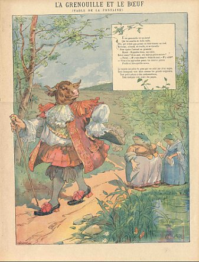
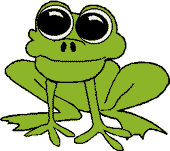
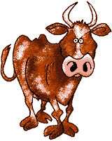

# La Grenouille qui veut se faire aussi grosse que le Boeuf

> Une Grenouille vit un Boeuf  
> Qui lui sembla de belle taille.  
> Elle, qui n'était pas grosse en tout comme un oeuf,  
> Envieuse, s'étend, et s'enfle, et se travaille,  
> Pour égaler l'animal en grosseur,  
> Disant :

> "Regardez bien, ma soeur ;  
> Est-ce assez ? dites-moi ; n'y suis-je point encore ?  
> - Nenni.  
> - M'y voici donc ?  
> - Point du tout.  
> - M'y voilà ?  
> - Vous n'en approchez point."

> La chétive pécore  
> S'enfla si bien qu'elle creva.  
> Le monde est plein de gens qui ne sont pas plus sages :  
> Tout bourgeois veut bâtir comme les grands seigneurs,  
> Tout petit prince a des ambassadeurs,  
> Tout marquis veut avoir des pages.

---
*Jean de la Fontaine*
