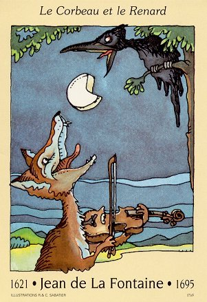
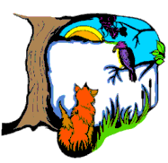
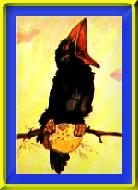

# Le Corbeau et le Renard

> Maître Corbeau, sur un arbre perché,  
> Tenait en son bec un fromage.  
> Maître Renard, par l'odeur alléché,  
> Lui tint à peu près ce langage :

> "Hé ! bonjour, Monsieur du Corbeau.  
> Que vous êtes joli ! que vous me semblez beau !  
> Sans mentir, si votre ramage  
> Se rapporte à votre plumage,  
> Vous êtes le Phénix des hôtes de ces bois.

> "A ces mots le Corbeau ne se sent pas de joie ;  
> Et pour montrer sa belle voix,  
> Il ouvre un large bec, laisse tomber sa proie.  
> Le Renard s'en saisit, et dit : 

> "Mon bon Monsieur,  
> Apprenez que tout flatteur  
> Vit aux dépens de celui qui l'écoute :  
> Cette leçon vaut bien un fromage, sans doute."

> Le Corbeau, honteux et confus,  
> Jura, mais un peu tard, qu'on ne l'y prendrait plus.

---
*Jean de la Fontaine*
