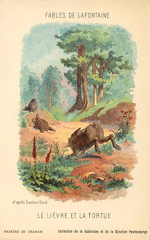
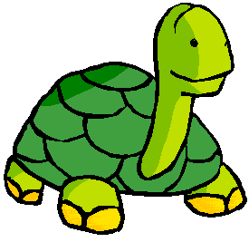
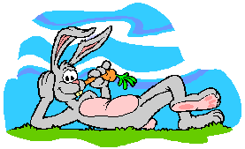

# Le Lièvre et la Tortue

> Rien ne sert de courir ; il faut partir à point.  
> Le Lièvre et la Tortue en sont un témoignage.  
> Gageons, dit celle-ci,  
> que vous n'atteindrez point sitôt que moi ce but.  
> - Sitôt ? Etes-vous sage ? repartit l'animal léger.  
> Ma commère,  
> il vous faut purger avec quatre grains d'ellébore.  
> - Sage ou non, je parie encore.

 

> Ainsi fut fait :  
> et de tous deux on mit près du but les enjeux :  
> Savoir quoi, ce n'est pas l'affaire,  
> Ni de quel juge l'on convint.  
> Notre Lièvre n'avait que quatre pas à faire ;  
> J'entends de ceux qu'il fait lorsque prêt d'être atteint  
> Il s'éloigne des chiens, les renvoie aux Calendes,  
> Et leur fait arpenter les landes.

> Ayant, dis-je, du temps de reste pour brouter,  
> Pour dormir, et pour écouter d'où vient le vent,  
> Il laisse la Tortue aller son train de Sénateur.  
> Elle part, elle s'évertue ;  
> Elle se hâte avec lenteur.

> Lui cependant méprise une telle victoire,  
> Tient la gageure à peu de gloire,  
> Croit qu'il y va de son honneur de partir tard.  
> Il broute, il se repose,  
> Il s'amuse à toute autre chose qu'à la gageure.

> A la fin quand il vit  
> Que l'autre touchait presque au bout de la carrière,  
> Il partit comme un trait ;  
> mais les élans qu'il fit furent vains :  
> la Tortue arriva la première.  
> Eh bien ! lui cria-t-elle, avais-je pas raison ?  
> De quoi vous sert votre vitesse ?  
> Moi, l'emporter !  
> et que serait-ce si vous portiez une maison ?

---
*Jean de la Fontaine*
